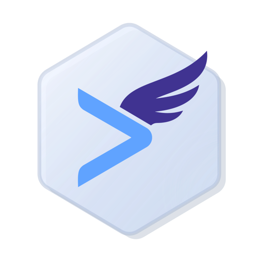
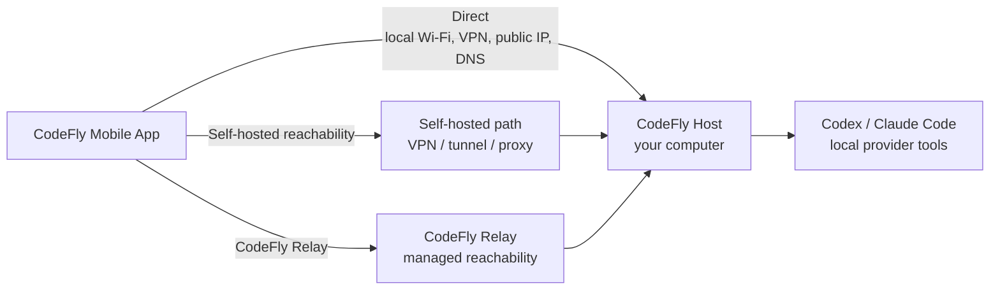

<p align="center">
  
</p>

<h1 align="center">CodeFly 🚀</h1>

<p align="center">
  <strong>Seamless mobile client for Codex and Claude Code workflows.</strong>
</p>

<p align="center">
  <a href="https://codefly.run">🌐 Website</a> ·
  <a href="docs/QUICKSTART.md">⚡ Quickstart</a> ·
  <a href="docs/SECURITY_WHITEPAPER.md">🔐 Security</a> ·
  <a href="docs/COMMERCIAL.md">💳 Commercial</a> ·
  <a href="docs/PRIVACY.md">🛡️ Privacy</a> ·
  <a href="docs/TERMS.md">📜 Terms</a> ·
  <a href="https://codefly.run/support">💬 Support</a>
</p>

<p align="center">
  <a href="https://apps.apple.com/app/id6762831575">
    
  </a>
  <a href="https://play.google.com/store/apps/details?id=com.codefly.run">
    
  </a>
</p>

CodeFly lets you start new tasks, resume existing sessions, approve actions, inspect changed files, review diffs, and keep a complete vibe coding flow moving from iOS or Android while Codex and Claude Code keep running on your own computer.

CodeFly is not a cloud IDE. It is a mobile control surface for provider sessions that already belong to your host machine, with Direct, self-hosted reachability, and CodeFly Relay connection modes.

## 📲 Install

Install the mobile app first:

<p>
  <a href="https://apps.apple.com/app/id6762831575">
    
  </a>
  <a href="https://play.google.com/store/apps/details?id=com.codefly.run">
    
  </a>
</p>

Then install the host package on the computer where Codex or Claude Code is already installed and signed in, or configured with a usable API key.

```bash
npm install -g codefly-host
```

Start the host menu:

```bash
codefly
```

CodeFly requires Node.js 20.19 or newer. Continue with the [Quickstart](docs/QUICKSTART.md) to bind the mobile app.

## 🔌 Connection Modes

| Mode | Best for | Sign-in | Cost |
| --- | --- | --- | --- |
| [Direct](docs/QUICKSTART.md#direct-mode) | Local Wi-Fi, VPNs, private overlays, reachable hostnames, or public addresses | Not required | Free forever |
| [Self-Hosted Relay](docs/SELF_HOSTED_RELAY.md) | Your own TCP proxy, tunnel, VPN, or network path | Not required | Free forever |
| [CodeFly Relay](docs/QUICKSTART.md#codefly-relay) | NAT, changing IP addresses, restrictive networks, travel, no port forwarding | OAuth sign-in recommended for multi-device use | Subscription by host seat |

We want CodeFly to stay fully usable for everyone who needs mobile access. Direct and self-hosted paths are not artificially limited just because they are free. CodeFly Relay provides convenient, maintenance-free, high-availability reachability with the same end-to-end encrypted security boundary as Direct.

CodeFly cannot access any data transmitted between the host and phone, and does not record transmitted content. See [Commercial](docs/COMMERCIAL.md), [Privacy](docs/PRIVACY.md), and the [Security Whitepaper](docs/SECURITY_WHITEPAPER.md) for details.

## ✨ Highlights

- Start new Codex or Claude Code sessions from your phone.
- Resume existing host sessions that are already available on the computer.
- Use a complete mobile vibe coding workflow: prompts, approvals, files, diffs, status, and interruptions.
- Choose Direct, self-hosted reachability, or CodeFly Relay based on your network.
- Configure Direct with IPv4, IPv6, or DNS host addresses, plus one or more local listener addresses.
- Keep provider tools, accounts, configuration, workspaces, and session history on your own machine.

## 🧩 Product Model

CodeFly keeps the setup simple:

1. Download CodeFly on iOS or Android.
2. Install `codefly-host` on the computer where Codex or Claude Code is installed and signed in, or configured with a usable API key.
3. Run `codefly`, choose Direct or Relay pairing, then tap the top-right `+` button in the mobile app to add the host.
4. Start a new session or continue an existing host session from mobile.

Direct Mode and self-hosted reachability are free forever because they do not consume CodeFly Relay infrastructure. CodeFly Relay is paid because it provides managed servers and bandwidth for reliable reachability.

## 📚 Documentation

- [Quickstart](docs/QUICKSTART.md): install CodeFly and bind the mobile app with Direct or Relay.
- [Security Whitepaper](docs/SECURITY_WHITEPAPER.md): encryption, pairing, Relay forwarding, and security boundaries.
- [Self-Hosted Relay](docs/SELF_HOSTED_RELAY.md): use Direct Mode over your own VPN, TCP proxy, tunnel, or private network.
- [Advanced Configuration](docs/ADVANCED.md): host settings, listener addresses, certificate management, and binding removal.
- [Commercial Model](docs/COMMERCIAL.md): Relay subscription model, trials, and availability.
- [Privacy](docs/PRIVACY.md): data processing, deletion, and retention model.
- [Terms of Service](docs/TERMS.md): product terms for Direct Mode, self-hosted reachability, CodeFly Relay, billing, and acceptable use.

## 🧭 How CodeFly Works

```text
CodeFly Mobile App <-> CodeFly Host <-> Codex / Claude Code
```

CodeFly Host runs on your computer and talks to Codex or Claude Code locally. The mobile app connects to the host, so the provider tools remain on your machine while your phone becomes a mobile control surface.



## 🤖 Supported Agents

- Codex
- Claude Code

## 📄 License

CodeFly is licensed under the [Apache License 2.0](LICENSE).
