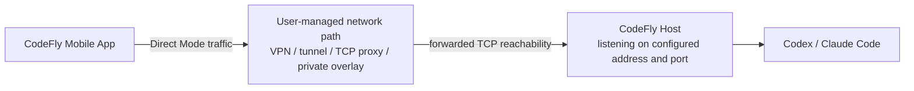

# Self-Hosted Relay

This document explains how to avoid CodeFly Relay by using Direct Mode over your own network path, such as a VPN, TCP proxy, tunnel, or private overlay network.

In CodeFly, this is best understood as self-hosted reachability: make the phone able to reach CodeFly Host directly, and keep using Direct Mode.



Self-hosted reachability is your own network setup. CodeFly does not provide extra support for third-party VPN, tunnel, proxy, firewall, router, or overlay configuration. The CodeFly side is intentionally simple: once the phone can reach the host address and port, configure that address in the host menu and pair with Direct Mode.

## Short Version

CodeFly Direct Mode works over any network path where the mobile app can reach the host address and port.

Examples:

- local Wi-Fi
- WireGuard
- Tailscale
- ZeroTier
- corporate VPN
- SSH TCP tunnel
- Cloudflare Tunnel
- ngrok
- FRP
- a user-managed TCP proxy

Direct Mode remains free forever. CodeFly Relay is only needed when you want CodeFly to provide managed remote reachability.

## What CodeFly Needs

Direct Mode needs one thing:

```text
Phone can reach Host address + Host port
```

The default host port is:

```text
7788
```

The QR code should contain an address reachable from the phone. Configure it with:

```bash
HOST_CLIENT_BIND=0.0.0.0, ::
HOST_CLIENT_DIRECT_PUBLIC_HOST=host.example.com
HOST_CLIENT_PORT=7788
```

Then run:

```bash
codefly
```

Choose Direct pairing and scan the QR code.

## Common Network Patterns

### Local Network

Use this when the phone and computer are on the same Wi-Fi or LAN.

```text
Phone -> Local Wi-Fi -> Host:7788
```

This is the simplest path and usually needs no extra configuration beyond allowing the host port through the local firewall.

### VPN Or Private Overlay

Use this when you want a private address that works across networks.

```text
Phone -> VPN / private overlay -> Host:7788
```

Set `HOST_CLIENT_DIRECT_PUBLIC_HOST` to the VPN or overlay address of the host.

### TCP Tunnel Or Proxy

Use this when you want a stable public address that forwards traffic to the host.

```text
Phone -> Tunnel hostname -> Host:7788
```

The tunnel or proxy must preserve the network path CodeFly needs for Direct Mode. If the proxy changes protocols, blocks long-lived connections, or rewrites traffic in a way the mobile app cannot use, Direct Mode may fail.

## Configure CodeFly Host

You can also configure this interactively:

```text
1. Manage local direct connection
3. Manage service address and port
```

This setting must be correct:

- `Host address` should be the tunnel, VPN, proxy, overlay, LAN, or public address reachable from the phone.
- `Host address` supports IPv4, IPv6, and DNS names. Enter only the host, without protocol, path, or port.
- `Listen addresses` should include the local interface that receives the forwarded traffic. IPv4 addresses, IPv6 addresses, and local hostnames are supported. `0.0.0.0` listens on all IPv4 interfaces, `::` listens on all IPv6 interfaces, and comma-separated values are supported.
- `Port` must match the port your network path forwards to the host.

When creating a Direct binding, CodeFly lists configured addresses and detected local network interface addresses so you can choose the address to encode into the QR code. Listen-only values such as `0.0.0.0`, `::`, `127.0.0.1`, and `localhost` are skipped as QR addresses.

## Security Notes

CodeFly application frames are still end-to-end encrypted between the phone and host in Direct Mode. A VPN, proxy, tunnel, or overlay provider may observe network metadata such as source, destination, timing, and traffic volume, but it should not be able to read CodeFly application payloads.

Do not expose the host port publicly unless you understand the network risk. Pairing still requires CodeFly's cryptographic device identity and auth token flow, but the host computer remains an important security boundary.

## Support Boundary

CodeFly can document the host settings needed for Direct Mode:

- host address
- host port
- QR pairing
- firewall basics
- CodeFly Host logs

CodeFly does not manage or troubleshoot third-party VPN, proxy, tunnel, firewall, router, or overlay infrastructure. In most cases, the network task is only: forward a stable TCP address to the CodeFly host port, then set that address in `Manage service address and port`.

## When To Use CodeFly Relay Instead

Use CodeFly Relay when:

- you do not want to configure VPNs, tunnels, or port forwarding
- your network blocks inbound connections
- your host changes networks often
- you need a simpler setup for multiple hosts
- you want managed host presence and remote reachability

CodeFly Relay is paid because it uses CodeFly infrastructure. Direct Mode remains free when you bring your own reachable network path.

## Network Setup Notes

CodeFly does not require a specific tunnel or VPN product. The network path only needs to make the phone reach the host address and port that CodeFly advertises in Direct Mode.

Common approaches:

- Tailscale or another private overlay: install it on the phone and host, confirm the phone can reach the host's overlay IP or DNS name, then set that value as `Host address`.
- WireGuard or another VPN: connect both devices to the same VPN, allow traffic to the host's CodeFly port, then use the host's VPN address as `Host address`.
- SSH tunnel: forward a stable local or remote TCP endpoint to the host's CodeFly port, then advertise the endpoint the phone can reach.
- Cloudflare Tunnel or another managed tunnel: expose a TCP-compatible endpoint that forwards to the host's CodeFly port, then advertise the tunnel hostname.
- ngrok, FRP, or another TCP proxy: forward a public TCP address to the host's CodeFly port, then advertise the proxy hostname or address.

After the network path works, run `codefly`, open `Manage local direct connection`, then `Manage service address and port`. Set `Listen addresses` to the local interface that receives the traffic and set `Host address` to the address the phone can actually reach.
